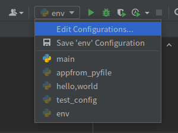

# 1. Flask

## 1. flask框架

核心：Werkzerug+Jinja2

轻——>只提供核心

**2.0.1**

## 2. 框架的对比

问题：

 1. django与flask谁好？

    没有最好 只有最合适

 2. 对比两个框架？

    轻           重

框架选择上：

自由，灵活，高度定制，flask

封装好的，单独开发 快速开发 django


## 3. 工程搭建

1. django

    django-admin startproject xxx

    python manage.py startproject users

    python manage.py runserver

2. Flask

    ```python
    from flask import Flask
    
    app = Flask(__name__)
    
    
    @app.route('/')
    def index():
        return 'hello,world'
    
    
    if __name__ == '__main__':
        app.run()
    ```

   

直接python+文件名

或者直接用pycharm运行


3. 初始化参数
    - import name
    - static_url_path
    - static_folder
    - template_folder


## 4. 加载config 配置 三种方式

1. 直接用类名加载 

    ```python
    from flask import Flask
    
    app = Flask(import_name=__name__)
    
    
    class DefaultConfig(object):
        '''默认配置'''
        SECRET_KEY = 'ABCDEFG'
    
    
    app.config.from_object(DefaultConfig)
    
    
    @app.route('/')
    def index():
        return app.config['SECRET_KEY']
    
    
    if __name__ == '__main__':
        app.run()
    ```

    > 优点：可以继承，复用

    > 缺点： 敏感数据直接暴露

    > 应用场景： 默认配置可以写在配置类中


2. 在文件中加载

    ```python
    from flask import Flask
    
    app = Flask(import_name=__name__)
    
    
    app.config.from_pyfile(filename="setting.py")
    
    
    @app.route('/')
    def index():
        print(app.config['SECRET_KEY'])
        return 'hello,world'
    
    
    if __name__ == '__main__':
        app.run()
    ```


> 优点：独立文件，保护敏感数据

> 缺点：不能继承,文件路径固定不灵活

> 应用场景：不考虑灵活性，仅保护敏感数据


3. 在环境变量中加载

    ```python
    from flask import Flask
    
    app = Flask(import_name=__name__)
    
    # 环境变量 需要在系统中
    '''
    export PROJECT_SETTING=setting.py
    '''
    # 变量只有单独终端可以拿到，有生命周期的 是局部变量
    app.config.from_envvar('PROJECT_SETTING')
    # app.config.from_envvar('PROJECT_SETTINGJH',silent=True)
    # silent的作用：如果PROJECT_SETING不存在 flask让你自己决定作用 False 不存在 直接抛出异常
    # silent = True 安静处理 如果没有也不会报错
    
    
    @app.route('/')
    def index():
        print(app.config['SECRET_KEY'])
        return 'hello,world'
    
    
    if __name__ == '__main__':
        app.run()
    ```

> 优点： 独立文件，保护敏感数据，文件路径固定灵活

> 缺点： 不方便，要设置环境变量


4. pycharm 中加载环境变量 

    




5. config加载方式一般结合使用

    ```python
    from flask import Flask
    
    
    class DefaultConfig(object):
        '''默认配置'''
        SECRET_KEY='DEFAULT VALUE'
    
    
    class DevelopmentConfig(DefaultConfig):
        DEBUG = True
    
    
    def create_flask_app(config):
        '''构建flask对象的工厂函数'''
        app = Flask(import_name=__name__)
        # 设置
        app.config.from_object(config)
    
        app.config.from_envvar(variable_name='PROJECT_SETTING',silent=True)
        return app
    
    
    # app = create_flask_app(DefaultConfig)
    app = create_flask_app(DevelopmentConfig)
    
    
    @app.route('/')
    def index():
        print(app.config['SECRET_KEY'])
        return 'hello,world'
    
    
    if __name__ == '__main__':
        # 提供的是调试服务器
        app.run(host='127.0.0.1',port=8888,)
    ```

    ## 5. 运行参数

    1. app.run(host='0.0.0.1',port='8888',debug=True)

    2. ```python
        再系统中
        export FLASK_APP='工程名'
        export FLASK_ENV=development
        
        
        flask run -h '127.0.01' -p 3399
        ```

    3. 在pycharm中

    

​		


## 5. 路由

**1.查询路由**

1. 在完成工程配置后  在终端设置完环境变量结束

    flask routes

2. 直接在项目中打印

    print(flask.url_map)

3. 构造全部路由信息的接口

```python
import json
from flask import Flask


class DefaultConfig(object):
    '''默认配置'''
    SECRET_KEY='DEFAULT VALUE'


# class DevelopmentConfig(DefaultConfig):
#     DEBUG = True


def create_flask_app(config):
    '''构建flask对象的工厂函数'''
    app = Flask(import_name=__name__)
    # 设置
    app.config.from_object(config)

    app.config.from_envvar(variable_name='PROJECT_SETTING',silent=True)
    return app


app = create_flask_app(DefaultConfig)
# app = create_flask_app(DevelopmentConfig)

'''
@app.route('/')
def index():
    print(app.config['SECRET_KEY'])
    return 'hello,world'


# print(app.url_map)
# todo： 需求：需要便利 url_map 取出特定信息 在一个特定借口返回
for rule in app.url_map.iter_rules():
    # 返回了一个列表
    print('name={} path={}'.format(rule.endpoint, rule.rule))
'''


@app.route('/')
def route_map():
    '''
    主视图，返回所有的视图网址
    :return:
    '''
    rules_iterator = app.url_map.iter_rules()
    return json.dumps({rule.endpoint: rule.rule for rule in rules_iterator})


# if __name__ == '__main__':
#     # 提供的是调试服务器
#     app.run(host='127.0.0.1',port=8888,)
```

主要有两种方式

1. flask routes
2. app.url_map


**2. 请求方式**

GET

OPTIONS(自带) -> 简化版的get请求用于询问 服务器接口信息的

比如接口允许的请求方式，允许的请求源头域名

- CORS 跨域 django-cors  

- www.meiduo.site -> api.meiduo.site

    - options api.meiduo.site/use/1

        返回response -> allow-orgin'www.meiduo.site'

    - GET api.meiduo.site/users/1

HEAD(自带) 简化版的get请求

- 只返回get请求处理时的相应请求 不反悔响应体


自定 post put delete patch

利用method参数 自定义接口的请求方式

405 methods not allowed

```python
from flask import Flask

app=Flask(import_name=__name__)


@app.route('/', methods=['POST'])
def index():
    return 'hello,world'


if __name__ == '__main__':
    app.run()
```


## 6. 蓝图

### 1. 创建蓝图过程

```python
from flask import Flask, Blueprint

app = Flask(import_name=__name__)

# 创建蓝图
user_bp = Blueprint('user', __name__)


# 定义蓝图路由
@user_bp.route('/profiles')
def get_profiles():
    return 'user profiles'


# 注册蓝图
app.register_blueprint(user_bp, url_prefix='/user')

# 导包 分解解耦 将路由当成一个app
from goods import goods_bp
app.register_blueprint(goods_bp)


# if __name__ == '__main__':
#     app.run()

```

在其他目录下（python包）创建views视图  

在\__init__包下写如下代码

```python
from flask import Blueprint

goods_bp = Blueprint('goods', __name__)


from . import views
```

在views.py下如下代码

```python
from . import goods_bp


@goods_bp.route('/goods')
def get_goods():
    return 'get_goods'
```


### 2. 蓝图内部文件

```python
admin=Blueprint('admin',__name__,static_folder='static_admin')
app.register_blueprint(admin,url_prefix='/admin')
```


> 可通过/admin/static_admin/filename 来访问也可以通过static_url_path来改变访问路径

```python
admin=Blueprint('admin',__name__,static_folder='static_admin',static_url_path='/lib')
app.register_blueprint(admin,url_prefix='/admin')
```


### 3. 蓝图内部模板文件

```python
admin=Blueprint('admin',__name__,static_folder='static_admin',static_url_path='/lib')
app.register_blueprint(admin,url_prefix='/admin')
```


## 7. 请求与相应

### 1. 处理请求

```http
请求报文
GET /path?a=1 http/1.1
content-Type: application/Json
...

body -> file form json xml


def func(request,....):
	request.

```


flask 不同于django 定义url 不用正则表达式 而是采用转换器语法

比如 /user/123

flask是 

```python
@app.route('/users/<user_id>')
def user_info(user_id):
    print(type(user_id))
    return 'hello user {}'.format(user_id)
```


通过某种规则 来匹配数据

```python
@app.route('/users/<int:user_id>')
def user_info(user_id):
    print(type(user_id))
    return 'hello user {}'.format(user_id)
```


```python
from flask import Flask
from werkzeug.routing import BaseConverter

app = Flask(__name__)


@app.route('/user/<int:user_id>')
def get_users_data(user_id):
    print(type(user_id))
    return 'get users {}'.format(user_id)

class MobileConverter(BaseConverter):
    regex = r'1[3-9]\d{9}'

app.url_map.converters['mobile'] = MobileConverter

@app.route('/sms_codes/<mobile:mob_num>')
def send_sms_code(mob_num):
    print(type(mob_num))
    return 'send sms code to {}'.format(mob_num)
```


https://127.0.0.1:5000/articles?channel_id=4353

```python
# /articles?channel_id=4353
@app.route('/articles')
def get_articles():
    channel_id = request.args.get('channel_id')
    return 'get articles is {}'.format(channel_id)
```


```python
# /articles?channel_id=4353
@app.route('/upload',method='post')
def upload_file():
   	f=request.files['pic']
    f.save('./demo.png')
    return 'ok'
```


### 2. 处理响应

```http
HTTP/1.1 200 ok
Content-Type: application/json
...
body
```

返回模板 render_template

```python
from flask import Flask,request,render_template
from werkzeug.routing import BaseConverter

app = Flask(__name__)


# @app.route('/')
# def home():
#     mint = 123
#     mstr = 'hello,world'
#     return render_template('index.html', my_str=mstr, my_int=mint)
@app.route('/')
def home():


    data = dict(
        my_str='hello,world',
        my_int=123
    )

    return render_template('index.html', **data)
```


### 3. 重定向

和django一样 redirect


### 4. 返回Json

```python
import json

json.dumps({})
```


- return json.dumps()
    - 仅仅把数据转换成格式返回
    - 响应头不做任何操作

- return jsonify
    - 转换成json格式字符串
    - 设置了响应头content-Type: application/json


### 5. 自定义状态码和响应头

> 元组方式

一个函数返回多值

```python
def func():
    return 1,2,3

ret= func()
r1,r2,r3=func()
```


元组方式 必须是(response,status,headers)

```python
@app.route('/demo4')
def demo4():
    # return '状态码为 666', 666
    # return '状态码为 666', 666, {'itcast': 'python'}
    return '状态码为 666', 666, [('itcast','python')]
```

> make_response 方式

```python

@app.route('/demo5')
def demo5():
    resp = make_response('make response 测试')
    resp.headers['Itcast'] = 'Python'
    resp.status='404 not found'
    return resp
```


### 6. cookie

- 设置cookie

```python
@app.route('/set_cookie')
def set_cookie():
    resp = make_response('set cookie')
    resp.set_cookie('Itcast','Python',max_age=3600)
    return resp
```

> 后面+ max_age=3600 是设置时间 不加默认下次关闭即删除cookie


- 读取cookie

    ```python
    @app.route('/get_cookie')
    def get_cookie():
        resp = request.cookies.get('Itcast')
        return resp
    ```

    

- 删除cookie

    ```python
    @app.route('/delete_cookie')
    def delete_cookie():
        resp=make_response('delete cookie ok')
        resp.delete_cookie('Itcast')
        return resp
    ```

    

### 7. session

- 设置session

    ```python
    class DefaultConfig(object):
        SECRET_KEY = 'kasjdaskldjas'
    
    
    app.config.from_object(DefaultConfig)
    
    @app.route('/set_session')
    def set_session():
        session['Itcast'] = 'Python'
        return 'set session is ok'
    ```

    

- 获取session

    ```python
    @app.route('/get_session')
    def get_session():
        Itcast = session.get('Itcast')
        return 'get Session Itcast is {}'.format(Itcast)
    ```

    

- 那么flask将session 存到了哪里去了

    flask------> 浏览器session  数字签名


## 8. 请求钩子与上下文

和django里面的中间件相同

1. 异常处理

```python
# /articles?channel_id=4353
@app.route('/articles')
def get_articles():
    channel_id = request.args.get('channel_id')
    if channel_id is None:
        abort(400) # 400 是代表bad request
    return 'get articles is {}'.format(channel_id)
```


**用 abort 来传入状态码**


2. 捕获错误

    展示给用户的友好提示

```python
@app.errorhandler(500)
def inter_server_error(e):
    return '服务器搬家了'
```

 也可以根据特定异常回

```python
@app.errorhandler(ZeroDivisionError)
def zerodivison(e):
    print(e)
    return '除数不能除以0'
```


3. 请求钩子

    启动中间件/中间层的作用

    middleware1  -> class middleware1

    ​										def pre_process()

    ​										def after_process()

    middleware2

    middleware3

    

    请求的处理过程 pre_process --->view  -->after_process

1 pre_process 2 pre_process 3 pre_process ------>view()

1.after_process.............------>client


中间件处理 不区分具体是哪个视图,对所有视图通通生效

- before_first_request
    - 在处理第一个请求时执行
- before_request
    - 在每次请求前处理
    - 如果在某修饰的函数中返回一个响应,试图函数将不再被调用.
- after_request
    - 如果没有抛出错误,在每次请求后执行
    - 接受一个参数,试图函数做出的响应
    - 在此函数中可以对响应值在返回之前做最后一步修改处理
    - 需要将参数中的响应在此参数进行返回.
- teardown_request
    - 在每次请求后执行
    - 接受一个参数,错误信息,如果有相关错误抛出


```python
from flask import Flask

app = Flask(__name__)


@app.before_first_request
def before_first_request():
    print('before_first_request')


@app.before_request
def before_request():
    print('before_request')


@app.after_request
def after_request(response):
    print('after_request')
    response.headers['Content-Type'] = 'application/json'
    return response


@app.teardown_request
def teardown_request(response):
    print('teardown_request')


@app.route('/')
def index():
    print('视图函数被调用')
    return 'index'
```

结果第一次调用和第二次调用

```text
before_first_request
before_request
视图函数被调用
after_request
teardown_request
127.0.0.1 - - [15/Oct/2021 17:06:48] "GET / HTTP/1.1" 200 -
before_request
视图函数被调用
after_request
teardown_request
```


4. 上下文

    并发访问同一个视图  用的同一个代码 那么返回的是哪个 id?

    request 上下文 根据环境来的 环境上下文

**1. 请求上下文**

- request
    - 封装了http请求的内容,针对的是htpp请求举例 user=request.args.get('user'),获取请求的参数
    - 你在A线程取出来的数据只和A有关系 ,B和B有关系

- session
    - 用来记录请求会话中的信息.针对的是用户信息.距离.session['name']=user.id 可以保存信息,也可以通过session.get['name']获取用户信息


**2. 应用上下文**

- current_app
    - 意思当前的app 指的是定义的app=Flask(\__name\_\_)
    - 有些时候文件是多文件 要想获取app 比较不方便


current示例

```python
from flask import Flask, request, abort


app = Flask(__name__)

app.redis_cli = 'redis client'


# /articles?channel_id=4353
@app.route('/articles')
def get_articles():
    channel_id = request.args.get('channel_id')
    print(app.redis_cli)
    if channel_id is None:
        abort(400) # 400 是代表bad request
    return 'get articles is {}'.format(channel_id)


from passport import bp

app.register_blueprint(bp)

```


```python
from flask import Blueprint, current_app

bp = Blueprint('passport', __name__)


@bp.route('/bp')
def viewfunc():
    print(current_app.redis_cli)
    return 'ok'
```


- g

    g对象就是个容器，是个仓库

    ```python
    # def db_query(user_id,user_name):
    #     print('user_id={},user_name={}'.format(user_id,user_name))
    #
    def db_query():
        user_id=g.user_id
        user_name=g.user_name
        print('user_id={},user_name={}'.format(user_id,user_name))
    
    
    @app.route('/')
    def get_user_profile():
        user_id = 123
        user_name = '小明'
        g.user_id=user_id
        g.user_name=user_name
        db_query()
        return 'hello,world'
    ```

    这样在访问根路径，


## 9. 上下文综合案例

分析

- 特定强制需求 - > 装饰器
- 所有试图的需求 - > 请求钩子


请求 ->  请求钩子（判断身份，对于未登录用户不做处理 放行） 

- >普通视图处理   

    > 强制登录视图—> 装饰器   


g.user_id=123 g.user_id=None


三次函数被一次请求调用 

用g对象调用传递

```python
from flask import Flask, request, abort, current_app, g

app = Flask(__name__)


# 请求钩子（尝试判断用户身份，对于未登录的用户不做处理 放行）并用g对象保存用户身份信息
@app.before_request  # 每个视图都要调用
def authentication():
    '''
    利用before_request请求钩子 在进入所有视图前先尝试判断用户身份
    :return:
    '''
    # todo: 此处利用鉴权机制（如cookie，session，jwt等）鉴别用户信息
    # if 已登录用户 用户有身份信息
    g.user_id = 123
    # else 未登录用户， 用户无身份信息
    # g.user_id = None


# 强制登录装饰器
def login_required(func):
    def wrapper(*args, **kwargs):
        # 判断用户是否登录
        if g.user_id is None:
            abort(401)
        else:
            # 已登录
            return func(*args, **kwargs)

    return wrapper


@app.route('/')
def index():
    return 'home page user_id={}'.format(g.user_id)


# 上层装饰器的主题 是下面一个主题
@app.route('/profile')
# 碍着谁装饰谁
@login_required
def get_user_profile():
    return 'user_profile page user_id={}'.format(g.user_id)
```


ps: g对象每次请求结束都会重设这个变量


上下文实现原理 -> Threadlocal 线程局部变量 


from flask import request

request -> 全局变量


/articles?channel_id=123 ->request.args.get('channel_id') ->123 Thread idA

/articles?channel_id=123 ->request.args.get('channel_id') ->124 Thred id B


request.args = {

​	'thread_a_id':123,

​	'thread_b_id':124 

}(存了多个数据 字典)
